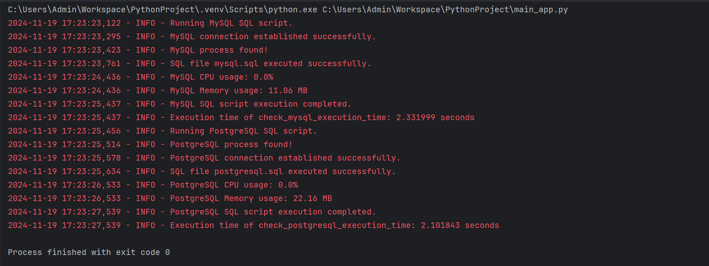

# **MySQL-Postgres-Benchmark**

This project provides a performance comparison between **MySQL** and **PostgreSQL** databases. It executes SQL scripts on both databases and monitors key system metrics such as **CPU** and **memory** usage during execution. The goal is to compare the performance of **MySQL** and **PostgreSQL** in handling various SQL operations and workloads.

> 
---

## **Table of Contents**

- [Features](#features)
- [Prerequisites](#prerequisites)
- [Setup and Installation](#setup-and-installation)
- [Configuration](#configuration)
- [Running the Application](#running-the-application)
- [Monitoring the Database](#monitoring-the-database)
- [Logging](#logging)
- [Troubleshooting](#troubleshooting)
- [MySQL vs PostgreSQL Comparison](#mysql-vs-postgresql-comparison)

---

## **Features**

- **Real-time Monitoring**: Monitors **CPU** and **memory** usage of MySQL and PostgreSQL processes during SQL script execution.
- **SQL Script Execution**: Executes SQL scripts on both MySQL and PostgreSQL databases.
- **Performance Comparison**: Compare MySQL vs PostgreSQL in terms of query performance and resource utilization.
- **Modular Architecture**: Code is structured for easy extension and maintenance.
- **Cross-Database Compatibility**: Supports both MySQL and PostgreSQL databases.
  
---

## **Prerequisites**

Before setting up the project, ensure that you have the following:

### **1. Python 3.x**

### **2. Database Servers**
   - **MySQL Server**
   - **PostgreSQL Server**

### **3. Python Libraries**
   - `mysql-connector-python`: MySQL database connector.
   - `pg8000`: PostgreSQL database connector.
   - `psutil`: For monitoring system resources (CPU, memory, etc.).

---

## **Setup and Installation**

Follow these steps to set up the project on your local machine.

### **1. Clone the Repository**

Clone the repository to your local machine:

```bash
git clone https://github.com/jeetendra29gupta/MySQL-Postgres-Benchmark.git
cd MySQL-Postgres-Benchmark
```

### **2. Set Up Virtual Environment (Recommended)**

Create and activate a Python virtual environment to isolate dependencies.

#### **For Windows:**
```bash
python -m venv .venv
.venv\Scripts\activate
```

#### **For macOS/Linux:**
```bash
python3 -m venv .venv
source .venv/bin/activate
```

### **3. Install Dependencies**

Once the virtual environment is activated, install the required libraries:

```bash
pip install -r requirements.txt
```

---

## **Configuration**

Before running the application, make sure your **MySQL** and **PostgreSQL** servers are set up correctly.

### **1. MySQL Configuration**
   - Make sure MySQL server is running.
   - Create a database named `store` (or modify the script with another database name).

Example commands to create the database:
```bash
mysql -u root -p
CREATE DATABASE store;
```

### **2. PostgreSQL Configuration**
   - Ensure PostgreSQL server is running.
   - Create a database named `store` (or modify the script with another database name).

Example commands to create the database:
```bash
psql -U postgres
CREATE DATABASE store;
```

### **3. SQL Script Files**
   Ensure that you have the following SQL script files:
   - `mysql.sql`: A SQL script with commands for MySQL.
   - `postgresql.sql`: A SQL script with commands for PostgreSQL.

These SQL files can contain various SQL commands like `CREATE TABLE`, `INSERT INTO`, etc., for testing purposes.

---

## **Running the Application**

Once your environment is set up, you can run the application.

### **Run the Application**

To start the application, execute the following command:

```bash
python main_app.py
```

This will:
1. Execute the **MySQL** SQL script (`mysql.sql`).
2. Monitor the **CPU** and **memory** usage of the MySQL process.
3. Execute the **PostgreSQL** SQL script (`postgresql.sql`).
4. Monitor the **CPU** and **memory** usage of the PostgreSQL process.

---

## **Monitoring the Database**

During execution, the `psutil` library is used to monitor the **CPU** and **memory** usage of both **MySQL** and **PostgreSQL**.

- **CPU Usage**: The percentage of CPU consumed by the database process.
- **Memory Usage**: The amount of memory used by the database process (in MB).

### **Key Features of Monitoring:**
- Monitors the database processes in separate threads.
- Logs the CPU and memory usage in real-time.
- Stops monitoring once the SQL script execution is complete.

---

## **Logging**

Logging is handled using Python’s built-in `logging` library. The log messages include performance metrics (CPU and memory usage) and other execution details, including errors.

### **Log Output Example:**

The log output will look something like this:

```
2024-11-19 18:42:16,760 - INFO - Running MySQL SQL script.
2024-11-19 18:42:16,981 - INFO - MySQL connection established successfully.
2024-11-19 18:42:17,016 - INFO - MySQL process found!
2024-11-19 18:42:17,368 - INFO - SQL file mysql.sql executed successfully.
2024-11-19 18:42:18,031 - INFO - MySQL CPU usage: 0.0%
2024-11-19 18:42:18,031 - INFO - MySQL Memory usage: 26.44 MB
2024-11-19 18:42:19,046 - INFO - MySQL SQL script execution completed.
2024-11-19 18:42:19,046 - INFO - Execution time of check_mysql_execution_time: 2.307480 seconds
2024-11-19 18:42:19,064 - INFO - Running PostgreSQL SQL script.
2024-11-19 18:42:19,107 - INFO - PostgreSQL process found!
2024-11-19 18:42:19,183 - INFO - PostgreSQL connection established successfully.
2024-11-19 18:42:19,321 - INFO - SQL file postgresql.sql executed successfully.
2024-11-19 18:42:20,133 - INFO - PostgreSQL CPU usage: 0.0%
2024-11-19 18:42:20,133 - INFO - PostgreSQL Memory usage: 23.04 MB
2024-11-19 18:42:21,138 - INFO - PostgreSQL SQL script execution completed.
2024-11-19 18:42:21,138 - INFO - Execution time of check_postgresql_execution_time: 2.092426 seconds
```

You can change the log level and format in the `utils.py` file based on your preferences (e.g., `INFO`, `DEBUG`, `ERROR`).

---

## **Troubleshooting**

If you run into issues, consider the following common troubleshooting steps:

### **1. Database Connection Issues**
- Ensure that both **MySQL** and **PostgreSQL** servers are running.
- Double-check your connection details in the `mysql_service.py` and `postgresql_service.py` files (e.g., database name, user credentials).

### **2. Missing Dependencies**
- Make sure you’ve installed all dependencies using the following command:
  ```bash
  pip install -r requirements.txt
  ```

### **3. Database Permissions**
- Ensure that the database user (e.g., `root` for MySQL, `postgres` for PostgreSQL) has the necessary permissions to create databases and execute the SQL scripts.

---

## **MySQL vs PostgreSQL Comparison**

| **Feature**              | **MySQL**                               | **PostgreSQL**                              |
|--------------------------|-----------------------------------------|---------------------------------------------|
| **Performance**           | Optimized for read-heavy workloads     | Better for write-heavy workloads & complex queries |
| **SQL Compliance**        | Less compliant with SQL standards      | Fully compliant with SQL standards         |
| **ACID Compliance**       | Yes, with some limitations             | Fully ACID-compliant with MVCC (Multi-Version Concurrency Control) |
| **Scalability**           | Vertical scaling, replication          | Horizontal scaling, table partitioning, sharding |
| **Replication**           | Master-slave replication               | Advanced replication (logical, synchronous) |
| **Concurrency**           | Limited, uses locking for consistency  | MVCC for high concurrency and non-blocking reads |
| **Data Types**            | Basic types, limited JSON support      | Advanced types (e.g., JSONB, arrays, custom types) |
| **Indexing**              | Basic indexing (B-tree, Full-text)     | Advanced indexing (e.g., GIN, GiST)        |
| **Use Cases**             | Web apps, content management systems   | Complex apps, financial apps, GIS systems |
| **Community**             | Large community, Oracle-backed         | Active open-source community, developer-focused |
| **Licensing**             | GPL, commercial licensing from Oracle | PostgreSQL License (permissive, open-source) |

### **Summary**:
- **MySQL** is ideal for **read-heavy** applications, simple queries, and is more **beginner-friendly** with its simpler architecture.
- **PostgreSQL** excels with **complex queries**, **write-heavy workloads**, and **advanced features** like MVCC, advanced indexing, and horizontal scaling for demanding applications. It is best suited for **complex apps**, **financial systems**, and **data analytics**.

---